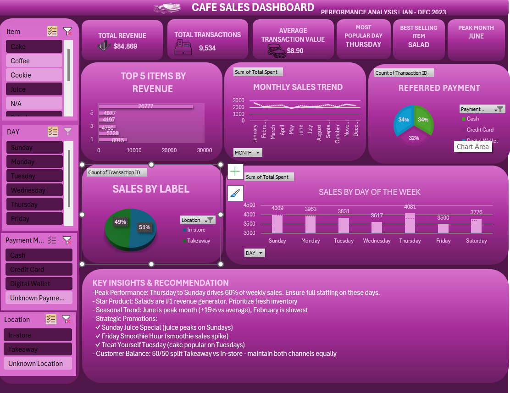

# cafe-sales-dashboard
Excel dashboard analyzing 10,001 cafe transactions to uncover sales patterns and provide actionable business insights.
# cafe-sales-dashboard
Excel dashboard analyzing 10,001 cafe transactions to uncover sales patterns and provide actionable business insights.
# Cafe Sales Dashboard

## Project Overview

Analyzed **10,001 sales transactions** from a cafe to identify revenue drivers, customer preferences, and operational patterns. Built an interactive Excel dashboard to provide actionable insights for business decision-making.

---

## Tools & Technologies

- **Microsoft Excel**: Pivot Tables, Advanced Formulas, Data Visualization
- **Data Cleaning**: Handling missing values, duplicates, and inconsistencies
- **Data Analysis**: Trend analysis, pattern recognition, KPI development
- **Dashboard Design**: Creating user-friendly, actionable visualizations

---

## Project Files

- `clean-cafe_sales_with_dashboard.xlsx` - Final cleaned dataset with interactive dashboard
- `dirty_cafe_sales.xlsx` - Original messy dataset (before cleaning)
- `Dashboard_preview.png` - Screenshot of the final dashboard

---

## The Challenge

The original dataset had significant data quality issues:
- **440+ missing item names** (4.6% of records)
- Multiple columns with "ERROR", "BLANK" and "UNKNOWN" values
- Inconsistent date formats
- Unvalidated calculations (some Total Spent ≠ Quantity × Price)
- No temporal categorization (day of week, month)

---

## My Process

### 1. Data Cleaning
- Removed duplicates and standardized data formats
- Handled missing values using price-tag analysis and business logic
- Created calculated fields: Day of Week and Month
- Validated data integrity across all numeric columns
- Replaced placeholder values ("ERROR", "UNKNOWN") with proper categories

### 2. Exploratory Analysis
- Identified top revenue-generating products
- Analyzed 12-month sales trends
- Examined day-of-week patterns for operational insights
- Investigated customer behavior (location and payment preferences)
- Performed cross-analysis of item performance by day

### 3. Dashboard Development
- Designed 6 core visualizations with clear hierarchy
- Added interactive slicers for dynamic filtering
- Created KPI cards for quick metric scanning
- Documented key insights and recommendations
- Applied consistent visual design and color scheme

---

## Key Findings

### Revenue Drivers
- **Salads** are the #1 revenue generator despite premium pricing (30% of total sales)
- Top 5 items (Salad, Sandwich, Smoothie, Juice, Cake) account for **85%** of revenue

### Operational Patterns
- **Thursday-Sunday** drives **60% of weekly sales** → requires adjusted staffing
- **Wednesday** is the slowest day → opportunity for promotions
- **June** is peak month (+15% vs. average); **February** is slowest

### Customer Insights
- **49/51 split** between Takeaway and In-store
- Payment methods are evenly distributed (Credit Card, Cash, Digital Wallet)
- Juice peaks on **Sundays**, Smoothies on **Fridays**, Cake on **Tuesdays**

---

## Business Recommendations

Based on the analysis, I recommended:

**Product Strategy**: Expand salad varieties and ensure fresh inventory Wed-Sat  
**Promotional Campaigns**:
   - "Sunday Juice Special" (juice demand peaks)
   - "Friday Smoothie Hour" (smoothie sales spike)
   - "Treat Yourself Tuesday" cake promotion

**Staffing Optimization**: Increase staff 40% on Thursday-Sunday, reduce mid-week  
**Seasonal Planning**: Develop February promotions to counter seasonal slump  
**Channel Strategy**: Maintain equal focus on both Takeaway and In-store operations

---

## Skills Demonstrated

- **Data Cleaning & Preparation**: Handling messy real-world data with multiple quality issues
- **Statistical Analysis**: Trend identification, pattern recognition, comparative analysis
- **Business Acumen**: Translating data insights into actionable recommendations
- **Data Visualization**: Creating clear, professional dashboards for stakeholder communication
- **Excel Expertise**: Advanced formulas (TEXT, IF, SUM), Pivot Tables, Charts, Slicers
- **Problem Solving**: Overcame multiple data challenges through logical reasoning

---

## How to Use This Project

1. Download `clean-cafe_sales_with_dashboard.xlsx`
2. Enable editing if prompted by Excel
3. Navigate to the **DASHBOARD** sheet
4. Use the slicers on the left to filter by:
   - Item type
   - Day of week
   - Payment method
   - Location
5. Explore insights and recommendations at the bottom

---

## Dashboard Features

- **KPI Cards**: Total Revenue, Transactions, Average Transaction Value
- **Top Performers**: Bar chart of top 5 items by revenue
- **Trend Analysis**: Line chart showing monthly sales patterns
- **Day-of-Week Analysis**: Column chart revealing operational patterns
- **Customer Preferences**: Pie charts for location and payment methods
- **Interactive Filters**: Slicers for dynamic data exploration
- **Actionable Insights**: Clear recommendations based on findings

---

## Connect With Me

- **LinkedIn**: [www.linkedin.com/in/ejiro-oghenegueke-a0827b386]
- **Email**: [maelismadore@gmail.com]

---

## Project Status
 **Completed** - [ October 2025]

---

## Acknowledgments

Dataset source: Kaggle - Dirty Cafe Sales Dataset

---

*This project demonstrates real-world data analysis skills including data cleaning, exploratory analysis, visualization, and business insight generation.*
